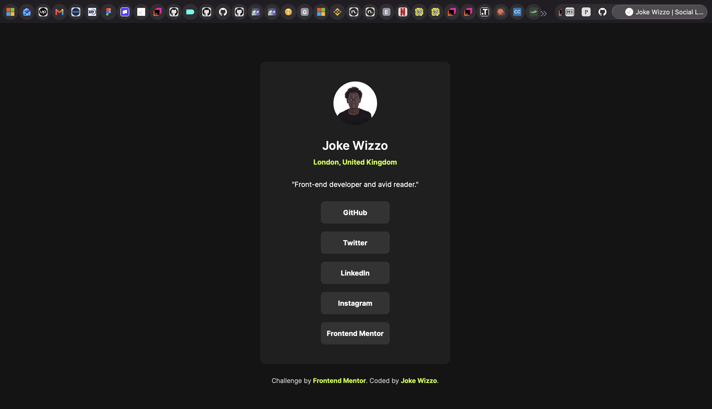

# Frontend Mentor - Social links profile solution

This is a solution to the [Social links profile challenge on Frontend Mentor](https://www.frontendmentor.io/challenges/social-links-profile-UG32l9m6dQ). Frontend Mentor challenges help you improve your coding skills by building realistic projects. 

## Social-Links Card

This is a responsive social link page built with plain HTML & CSS.

## Table of contents

- [Overview](#overview)
  - [The challenge](#the-challenge)
  - [Screenshot](#screenshot)
  - [Links](#links)
- [My process](#my-process)
  - [Built with](#built-with)
  - [What I learned](#what-i-learned)
  - [Useful resources](#useful-resources)
  - [AI Collaboration](#ai-collaboration)
- [Author](#author)
- [Acknowledgments](#acknowledgments)

## Overview

This project is based on the Frontend Mentor product page challenge and has been adapted into a custom implementation for the social-links Card experience.

### The challenge

Users should be able to:

- See hover and focus states for all interactive elements on the page

### Screenshot



### Links

- Solution URL: [Coming soon](https://your-solution-url.com)
- Live Site URL: [Coming soon](https://your-live-site-url.com)

## My process

### Built with

- Semantic HTML5 markup
- CSS custom properties
- Flexbox
- CSS Grid

### What I learned

I've properly understood the use of "divs" blocks in an html5 with class attributes definitions which is very crucial; to understand better, take a look at the code snippet as shown below.

Also learned the proper project color theme usage of the footer attribute in order to match the main content colors for a better work flow.

To have a look at some of my code snippets, see below:👇👇

```html
<h1><div class="card__identity">
        <h1 class="card__name">Joke Wizzo</h1>
        <p class="card__location">London, United Kingdom</p>
      </div></h1>
```
```css
.attribution a {
  color: var(--color-green);
  font-weight: 700;
}
```

### Useful resources

- [CSS-Tricks](https://css-tricks.com/) - Useful for layout and styling techniques. I found the practical examples especially helpful for refining responsive UI work.
- [Frontend Mentor](https://www.frontendmentor.io) - Helpful for practicing real-world UI implementation from design references. I liked the structure of the challenges and will keep using this pattern.

### AI Collaboration

- I used AI tools, including GitHub Copilot and ChatGPT, to help with brainstorming, and debugging this project. 

- They were useful for quickly generating ideas, checking syntax, and improving wording in documentation.

- What worked well was using AI to speed up repetitive tasks and get quick guidance when I was stuck.

- What did not work as well was relying on AI for final design decisions, since the interface still needed manual testing and adjustments to match the intended user experience.

## Author

- Website - [Joke wizzo](https://www.wizzoviz.tech/)
- Twitter - [Stillwizzo](https://x.com/stillwizzo)
- LinkedIn - [Kuach John](https://www.linkedin.com/in/kuach-john/) 
- Frontend Mentor - [Kuach-joke](https://www.frontendmentor.io/profile/Kuach-joke)

## Acknowledgments

Frontend Mentor for providing the challenge and design inspiration.

The open web community for helpful documentation and examples throughout development.

